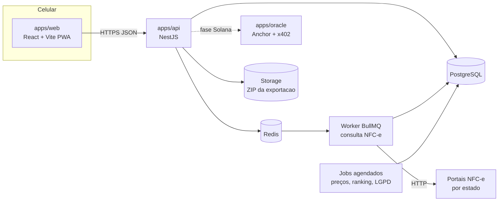

# Arquitetura

## Visão geral



Em produção, `PostgreSQL` e `Storage` são o **Supabase**, usado só como banco
gerenciado e armazenamento de arquivo: a API continua sendo o único cliente do
banco, sem PostgREST e sem Supabase Auth. O Redis fica no servidor, porque o
Supabase não tem. Ver `13-SUPABASE.md`.

## Estrutura do monorepo

```
gastemenos/
├─ CLAUDE.md
├─ docs/                      # este pacote
├─ design-system/             # tokens e referência visual (fonte)
├─ referencia/telas/          # 34 telas aprovadas (.dc.html)
├─ apps/
│  ├─ web/                    # PWA
│  │  └─ src/
│  │     ├─ app/              # providers, router, tema, tamanho de texto
│  │     ├─ routes/           # uma pasta por rota (ver 05-TELAS-E-ROTAS)
│  │     ├─ features/         # scanner, receipts, prices, lists, game, account
│  │     ├─ lib/              # api client, formatters, speech, haptics
│  │     └─ sw/               # service worker (Workbox)
│  ├─ api/
│  │  └─ src/modules/
│  │     ├─ auth/             # e-mail/senha, Google OAuth, JWT, refresh, 2 etapas
│  │     ├─ users/            # conta, status (ativa, pausada, encerrando)
│  │     ├─ profile/          # perfil de consumo, preferências, acessibilidade
│  │     ├─ receipts/         # notas, fila, adaptadores por UF
│  │     ├─ products/         # normalização, categorias, GTIN
│  │     ├─ stores/           # CNPJ, endereço, geohash
│  │     ├─ prices/           # observações e agregados por região
│  │     ├─ lists/            # lista de compras e sugestões
│  │     ├─ game/             # pontos, níveis, selos, sequência, ranking, convites
│  │     ├─ offers/           # parceiros e ofertas patrocinadas
│  │     ├─ notifications/    # central, web push, preferências
│  │     ├─ privacy/          # exportar dados, excluir conta, consentimentos
│  │     └─ admin/            # cadastro de ofertas, moderação
│  └─ oracle/                 # fase Solana (separada)
├─ packages/
│  ├─ tokens/                 # tokens.json → tokens.css + tailwind preset
│  ├─ ui/                     # componentes do design system em TSX
│  └─ shared/                 # zod schemas, tipos, formatadores
├─ prisma/schema.prisma       # (movido para apps/api/prisma)
└─ docker-compose.yml
```

## Web (PWA)

- **Roteamento**: React Router com rotas protegidas (`RequireAuth`) e redirecionamento para `/boas-vindas/1` no primeiro acesso.
- **Dados**: TanStack Query com cache persistido em IndexedDB (`@tanstack/query-async-storage-persister`) para o Início abrir sem rede.
- **Tema e acessibilidade**: `AppearanceProvider` grava em `<html>` os atributos `data-theme` (`light` | `dark` | `contraste`, ou nenhum para seguir o sistema), `data-text-size` (`normal` | `grande` | `muito-grande`) e `data-reduce-motion`. As preferências vêm da API e ficam em cache local para aplicar antes do primeiro desenho.
- **Modo fácil**: preferência `easyMode`; quando ligada, `/inicio` renderiza a variante `MainFacil` e a barra inferior tem 3 itens.
- **Câmera**: `getUserMedia({ video: { facingMode: 'environment' } })`, `BarcodeDetector` com formato `qr_code` quando existir, senão `@zxing/browser`. Lanterna via `track.applyConstraints({ advanced: [{ torch: true }] })` quando suportado (esconda o botão se não for). Vibração com `navigator.vibrate(80)` ao ler.
- **Voz**: `speechSynthesis` com voz `pt-BR` para "Ler em voz alta" e o botão Ouvir do modo fácil.
- **Offline**: leituras feitas sem rede entram numa fila local (IndexedDB) e são enviadas quando a conexão volta (Background Sync quando houver; senão ao abrir o app).
- **Push**: Web Push com VAPID; pedir permissão só depois da primeira nota lida, com explicação antes.
- **Instalação**: manifest com nome "GasteMenos", `theme_color` #0E4D3A, `background_color` #F5F3EC, ícones gerados de `design-system/logos/gastemenos-mark.svg`.

## API

- REST JSON versionada em `/v1`. Autenticação por access token JWT (15 min) no header e refresh token rotativo em cookie `httpOnly`, `Secure`, `SameSite=Lax`.
- Leitura de nota é assíncrona: `POST /v1/receipts` cria a nota como `PENDING` e enfileira; o web acompanha por `GET /v1/receipts/:id` (polling a cada 1,5 s por até 30 s) ou SSE em `/v1/receipts/:id/events`.
- Jobs agendados (BullMQ repeatable):
  - `prices:aggregate` a cada 15 min: recalcula agregados de preço por produto × região × dia.
  - `game:ranking` a cada hora: ranking do mês corrente; no dia 1 às 00:05 fecha o mês anterior e distribui selos.
  - `game:streak` todo domingo às 18h: aviso "sequência em risco".
  - `privacy:purge` diário: apaga contas com exclusão agendada vencida.
  - `lists:suggest` diário: calcula intervalos de recompra por produto e usuário.

## Região e preços

- Cada loja tem latitude/longitude (geocodificação do endereço da nota, com cache) e `geohash` de 5 caracteres (célula de cerca de 5 km).
- A "região" do usuário é o geohash do CEP informado mais as 8 células vizinhas (raio aproximado de 5 km, como nas telas).
- Preço da região = média aparada (descarta 10% nas pontas) das observações dos últimos 7 dias; histórico mensal = média aparada do mês.
- **Anonimato mínimo**: um preço regional só aparece com pelo menos 5 notas de pelo menos 3 pessoas diferentes; abaixo disso a tela mostra "Ainda juntando preços desta região".

## Produtos

- A página pública da NFC-e nem sempre traz o código de barras (GTIN). Guarde `rawDescription`, `storeCode` e `gtin` (quando houver).
- Casamento de produto: GTIN quando existir; senão, descrição normalizada (minúsculas, sem acento, unidades padronizadas: "500G" → "500 g", "1L" → "1 l") + loja + código interno. Guarde o vínculo para não refazer.
- Categorias iniciais: Mercearia, Bebidas, Hortifrúti, Laticínios, Carnes, Limpeza, Higiene, Padaria, Outros. Classificação por dicionário de palavras-chave, com correção manual pelo admin.

## Configuração (variáveis de ambiente)

```
DATABASE_URL, REDIS_URL
JWT_SECRET, JWT_REFRESH_SECRET
GOOGLE_CLIENT_ID, GOOGLE_CLIENT_SECRET, GOOGLE_CALLBACK_URL
VAPID_PUBLIC_KEY, VAPID_PRIVATE_KEY, VAPID_SUBJECT
MAIL_FROM, SMTP_URL
GEOCODER_URL (Nominatim próprio ou serviço pago), GEOCODER_USER_AGENT
APP_URL (web), API_URL
```
