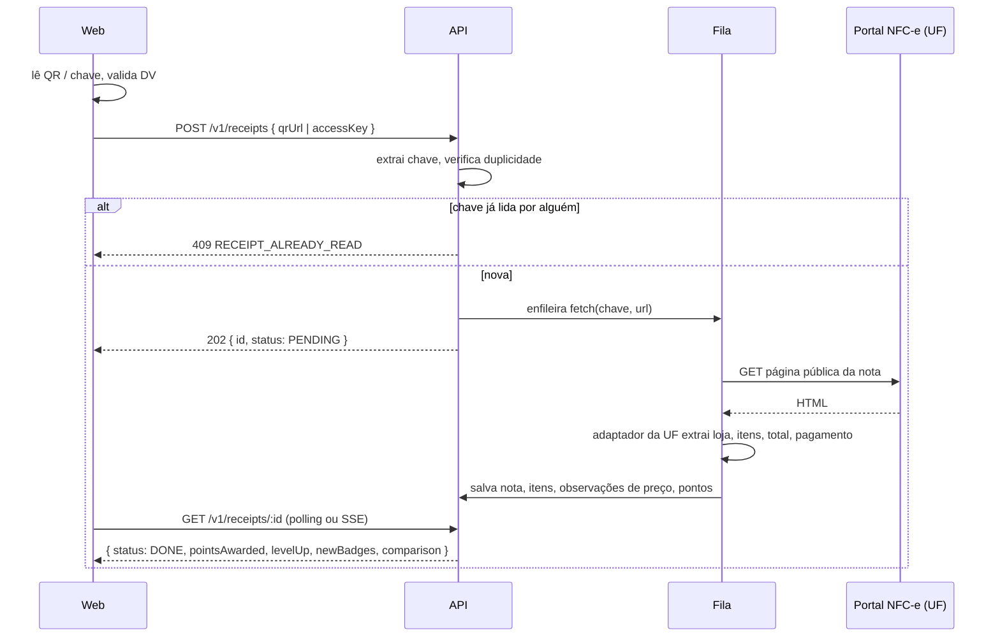

# Leitura da nota fiscal (NFC-e)

## O que a pessoa pode enviar

1. **QR code** lido pela câmera ou por foto da galeria. O conteúdo é uma URL do portal da NFC-e do estado emissor, com um parâmetro que começa pela chave de acesso.
2. **Chave de acesso** digitada: 44 números impressos perto do QR code (a tela aceita com ou sem espaços).

## Chave de acesso (44 dígitos)

| Posição | Tamanho | Campo |
| --- | --- | --- |
| 1–2 | 2 | código IBGE da UF (53 = DF) |
| 3–6 | 4 | ano e mês da emissão (AAMM) |
| 7–20 | 14 | CNPJ do emitente |
| 21–22 | 2 | modelo (65 = NFC-e; recuse outros modelos com mensagem clara) |
| 23–25 | 3 | série |
| 26–34 | 9 | número da nota |
| 35 | 1 | tipo de emissão |
| 36–43 | 8 | código numérico |
| 44 | 1 | dígito verificador (módulo 11) |

Valide sempre no web (feedback imediato) e na API:
- 44 dígitos numéricos, modelo 65, DV correto.
- AAMM não pode estar no futuro nem ter mais de 6 meses (notas antigas não valem pontos; aceite a leitura mas marque `pointsEligible = false`).

## Fluxo



## Adaptadores por estado

- Interface `NfceAdapter { uf: string; canHandle(url): boolean; fetch(key, url): Promise<ParsedReceipt> }`.
- **DF** (os exemplos das telas são em Brasília) e **SP** (onde há mais nota para testar, e onde o aplicativo anterior já lia em produção) primeiro; depois GO, MG, RJ, PR, RS. Registre cada adaptador num mapa por código IBGE.
- Cada adaptador tem testes com HTML real salvo em `apps/api/test/fixtures/nfce/<uf>/*.html` (remova CPF do consumidor dos fixtures).
- A página pública varia por estado e muda sem aviso: o parser deve ser tolerante (procurar por rótulos de texto, não por posição) e registrar `PARSE_FAILED` com o HTML guardado em storage para correção.
- Alguns portais pedem captcha na consulta pela chave digitada. Nesse caso a nota fica `NEEDS_QR` e o app pede: "Não conseguimos abrir essa nota pela chave. Tente ler o QR code."
- Respeite os portais: no máximo 1 requisição por segundo por UF, `User-Agent` identificado, retry exponencial (3 tentativas), cache de 24 h por chave.
- **Só visite os endereços da lista do adaptador** (`hostsPermitidos`). A URL do QR vem do celular da pessoa, e QR é fácil de forjar — um adesivo na gôndola faria o servidor buscar o endereço do atacante, inclusive endereço interno que só ele alcança. A conferência é por host exato, nunca por sufixo.

### DF, medido com uma nota real (25/09/2026)

- O QR das notas do DF aponta para `http://dec.fazenda.df.gov.br/ConsultarNFCe.aspx?p=<chave>|<versão>|<ambiente>|<idCSC>|<hash>`, e esse host **redireciona** para `ww1.receita.fazenda.df.gov.br/DecVisualizador/…`. Os dois precisam estar em `hostsPermitidos`, e o buscador segue os redirecionamentos **na mão**, conferindo o host de cada parada: `redirect: 'follow'` saltaria sozinho e anularia a conferência inicial.
- O parâmetro `p` tem de vir **inteiro**. Com `<chave>|3|1` só, o portal responde "103 - Identificador de CSC inexistente" e cai na página de captcha. É o erro que aparece quando o QR foi copiado pela metade.
- **Com só os 44 dígitos não funciona**: o portal confere o hash que vai dentro do QR e responde "Hash QR Code inválido" (código 100).
- A consulta por chave do Portal de Serviços (`ww1.receita.fazenda.df.gov.br/documentosfiscais/consultar`) é uma aplicação Angular atrás do desafio da Cloudflare. Não é página para ler.
- Existe uma rota por chave no visualizador — `ww1.receita.fazenda.df.gov.br/DecVisualizador/Nfce/Captcha?Chave=<44 dígitos>` — e ela é literalmente uma página de captcha (Cloudflare Turnstile), com um formulário que só avança com o token. O captcha está ali de propósito, para impedir leitura automatizada: **não é para contornar**. É a confirmação de que, no DF, o caminho legítimo do aplicativo é o QR.
- Consequência: no DF, chave digitada resulta em `NEEDS_QR` **sem visitar o portal**, e a tela de digitar a chave já avisa isso antes de a pessoa enviar.
- O host `dfe.fazenda.df.gov.br`, que a primeira versão do adaptador usava, **não existe** — nenhum teste pegou porque todos usam HTML salvo.

## ParsedReceipt

```ts
type ParsedReceipt = {
  accessKey: string;
  store: { cnpj: string; name: string; address?: string; city?: string; uf: string };
  issuedAt: string;            // ISO
  totalCents: number;
  discountCents?: number;
  paymentMethod?: 'PIX' | 'CREDITO' | 'DEBITO' | 'DINHEIRO' | 'VALE' | 'OUTRO';
  items: Array<{
    rawDescription: string;
    storeCode?: string;
    gtin?: string;
    quantity: number;          // 3 casas decimais
    unit: string;              // UN, KG, L...
    unitPriceCents: number;
    totalCents: number;
  }>;
  consumerCpfPresent: boolean; // nunca guardar o CPF lido da nota
};
```

## Depois de ler

1. Cria ou atualiza `Store` (geocodifica o endereço uma vez).
2. Casa cada item com `Product` (ver 02-ARQUITETURA, Produtos) e grava `PriceObservation`.
3. Calcula a comparação com a média da região para a resposta ("Você pagou R$ 14,20 abaixo da média").
4. Credita pontos, verifica nível, selos e sequência (07-GAMIFICACAO) numa única transação.
5. Atualiza a lista de compras sugerida.
6. Se a pessoa ativou "Vibrar ao concluir" ou "Ler em voz alta", a resposta traz `speech: "Nota do Supermercado Vila Nova, 187 reais e 40 centavos. Você ganhou 60 pontos."` para o web falar.

## Mensagens de erro (texto final das telas)

| Código | Mensagem |
| --- | --- |
| `INVALID_QR` | "Esse QR code não é de uma nota fiscal. Aponte para o código no rodapé da nota." |
| `INVALID_KEY` | "A chave precisa ter 44 números. Confira e tente de novo." |
| `NOT_NFCE` | "Essa é uma nota de outro tipo. Por enquanto só lemos notas de compras em lojas (NFC-e)." |
| `RECEIPT_ALREADY_READ` | "Essa nota já foi lida. Cada nota vale uma vez." |
| `NEEDS_QR` | "Não conseguimos abrir essa nota pela chave. Tente ler o QR code." |
| `PORTAL_UNAVAILABLE` | "O site da Secretaria da Fazenda está fora do ar. Guardamos sua nota e vamos tentar de novo sozinhos." |
| `PARSE_FAILED` | "Não conseguimos ler os itens dessa nota. Nossa equipe vai olhar e te avisar." |

### SP, medido com a mesma régua (25/09/2026)

- `https://www.nfce.fazenda.sp.gov.br/qrcode?p=…` redireciona para
  `ConsultaQRCode.aspx` e **não tem captcha**. É o caminho do aplicativo.
- A consulta pública por chave (`ConsultaPublica.aspx`) **tem reCAPTCHA**. Mesma
  conclusão do DF: chave digitada vira `NEEDS_QR` sem visitar o portal.
- O parser está validado contra uma nota real de SP (Zaffari, 29/08/2026, 66
  itens, R$ 1.901,57), em duas versões da página: com as classes do site e **sem
  classe nenhuma**. A segunda é a que prova que a leitura sobrevive a uma
  mudança de HTML, porque só restam os rótulos visíveis.
- O que é real no fixture e o que foi reconstruído está escrito em
  `apps/api/test/fixtures/nfce/sp/montar.mjs`. O CPF do consumidor foi
  substituído por `000.000.000-00`; o campo continua lá porque o parser precisa
  detectar que existia.
